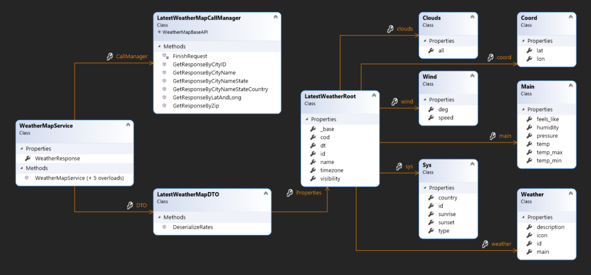

# Group-API-Mini-Project

# WPF-Entity-Framework-Project

## Sprint Goal
Sprint Goal description

## Project Goal
Project Goal description

## Project Definition of Done
### Project Definition of Done
- [] Definition of Done1
- [x] Definition of Done1

## Class Diagram

## Sprints
### Sprint API (modify name according to Project Board name)
### SP-API Project Board Start

### SP-1 Project Board Finish

### SP-1 Review

### SP-1 Retrospective

## Project Overview

## Project Review

## Project Retrospective
### What have I learned?
.

### What would I do differently next time?
.

### What would I do next?
.
